## 工作负载概述

工作负载页面是容器应用的管理中心，分为：
- **有状态集 (StatefulSet)**：适合数据库等需要持久化存储的应用
- **无状态集 (Deployment)**：适合 Web 应用等无状态服务

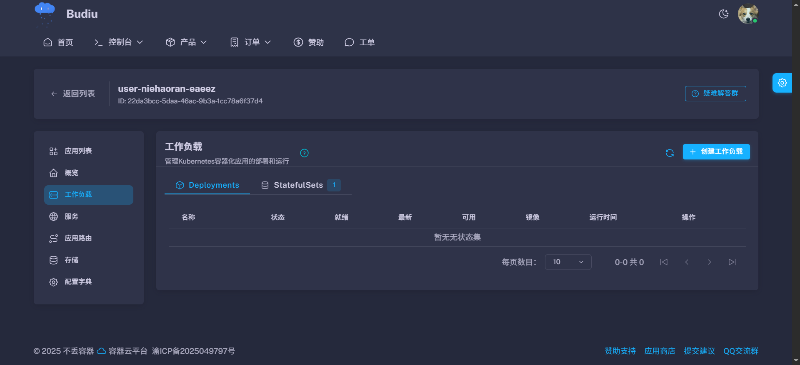

## 创建工作负载

点击"创建工作负载"，选择配置方式：

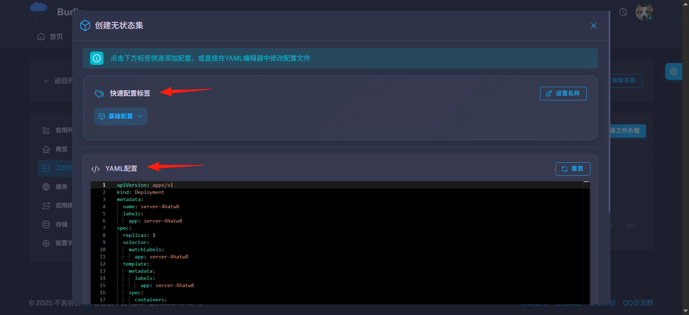

- **快速配置标签**：图形化配置，新手友好
- **YAML 配置**：适合熟悉 Kubernetes 的用户

## 实战案例：部署 AList 文件管理器

以 `xhofe/alist` 镜像为例，对比 Docker 命令和平台配置：

**Docker 部署命令：**
```bash
docker run -d \
  --name alist \
  -p 5244:5244 \
  -v /host/alist/data:/opt/alist/data \
  -e ALIST_LOG_LEVEL=INFO \
  --memory=256m \
  --cpus=0.5 \
  xhofe/alist:latest
```

### 1. 容器配置

设置镜像地址和资源限制：
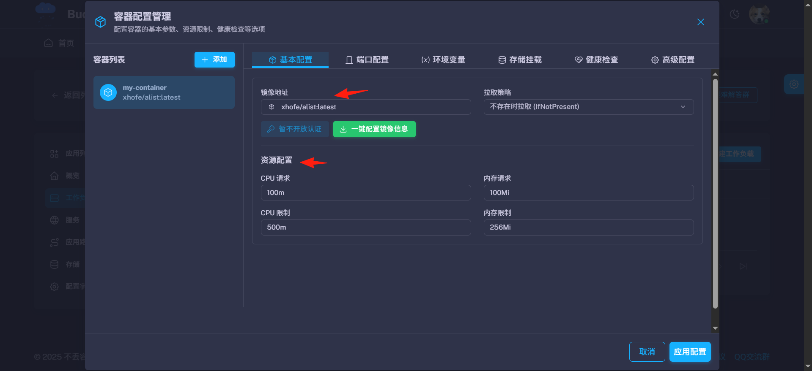

**配置说明：**
- **镜像**：`xhofe/alist:latest`
- **CPU 限制**：0.5 核心
- **内存限制**：256MB

### 2. 服务配置

开放端口供外部访问：
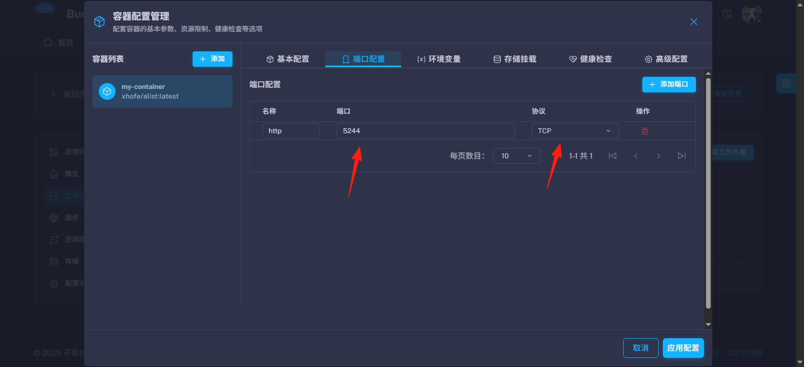

**端口配置：**
- **容器端口**：5244
- **协议**：TCP
- **服务类型**：选择合适的访问方式

### 3. 环境变量

设置应用运行所需的环境变量：
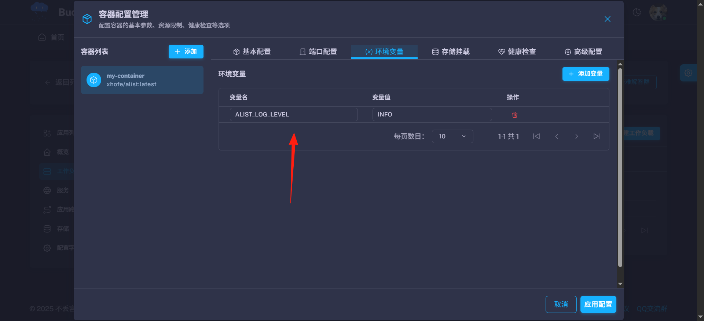

**常用变量：**
- `ALIST_LOG_LEVEL=INFO`：设置日志级别
- 其他应用特定变量

### 4. 存储卷挂载

配置数据持久化存储：
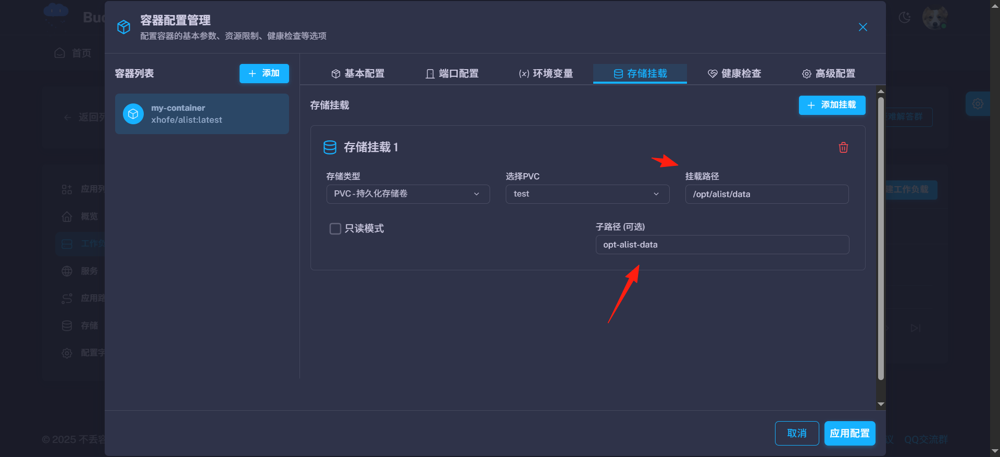

**挂载配置：**
- **存储卷**：选择已创建的 PVC
- **挂载路径**：`/opt/alist/data`
- **子路径**：可选，相对路径（如 `alist-data`）

> **注意：** 使用前需先创建存储卷，参考 [存储操作指南](/posts/不丢云操作指南-存储/)

### 5. 完成部署

设置工作负载名称并创建：
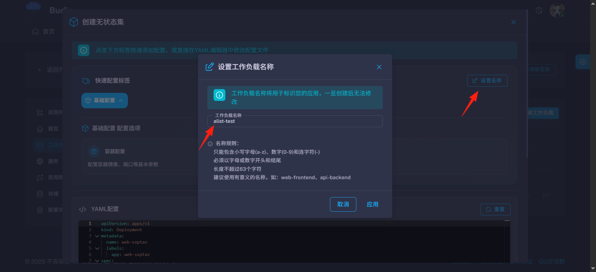

部署成功后，状态显示为 **Running**：
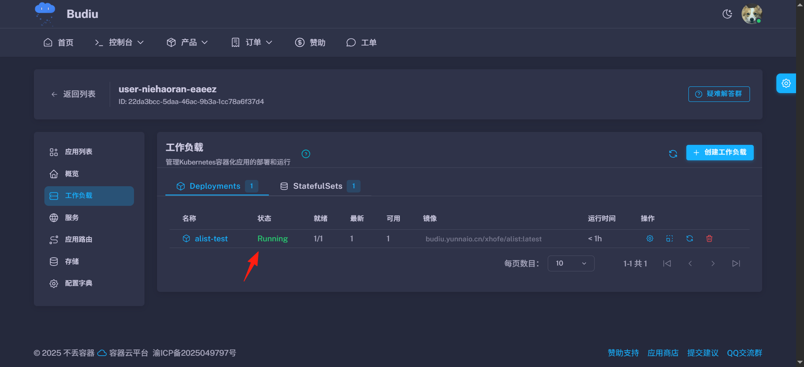

> **故障排查：** 如果状态为 Pending，检查"事件"页面查看错误信息

## 工作负载管理功能介绍

### Pod 列表
查看当前运行的 Pod 实例：
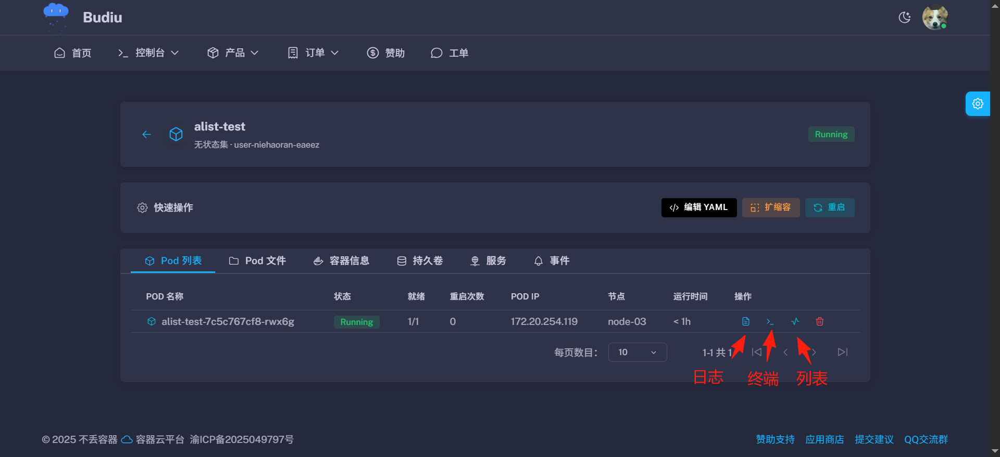

### 文件管理
直接操作容器内文件系统：
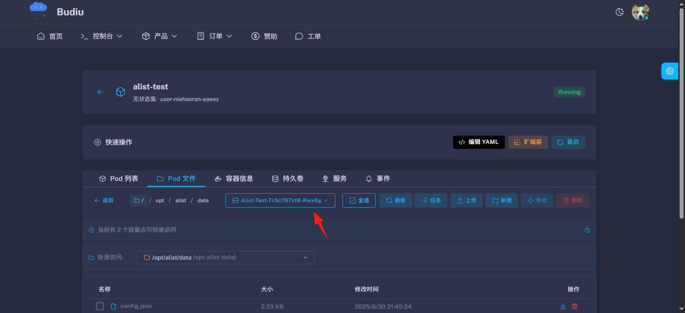

> **提示：** 如果存储为 ReadWriteMany 模式，修改任意 Pod 文件即可同步

### 容器信息
查看 Pod 内镜像和运行状态：
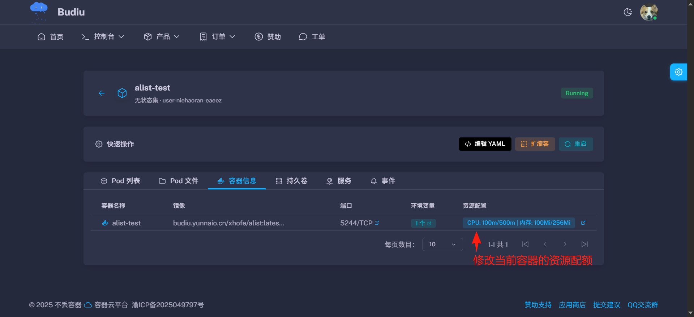

### 持久卷管理
管理绑定的存储卷：
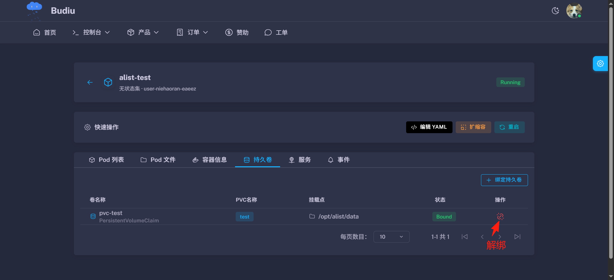

### 服务配置
配置外网访问方式：
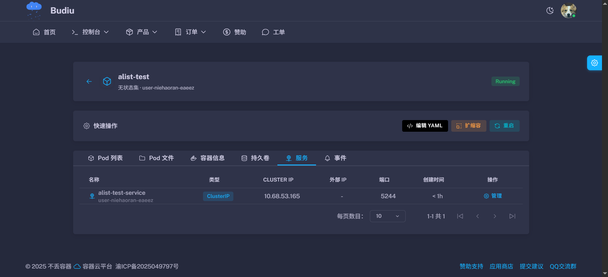

### 事件日志
查看操作记录和错误信息：
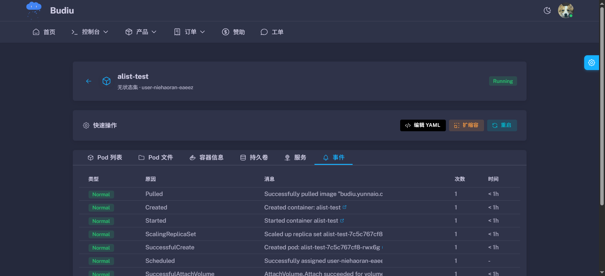

## 部署成功

应用成功运行的效果（需要查看 服务篇 来完成访问）：
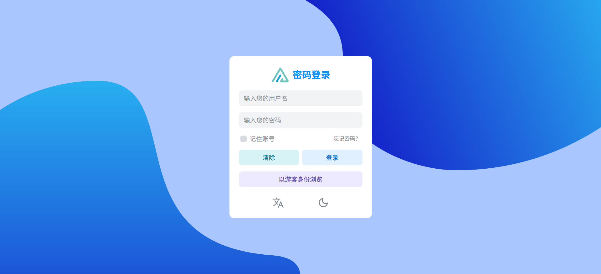

---

## 常见问题

**Q: Pod 状态一直是 Pending？**
A: 检查事件页面，常见原因：
- 资源不足（CPU/内存）
- 存储卷挂载失败
- 镜像拉取失败

**Q: 如何选择有状态集还是无状态集？**
A: 
- **有状态集**：数据库、缓存等需要固定存储和网络标识
- **无状态集**：Web 应用、API 服务等可以随意重启

**Q: 存储卷挂载失败？**
A: 确认：
- PVC 已创建且状态为 Bound
- 挂载路径正确
- 访问模式匹配（单节点/多节点）

---

## 相关指南

- **上一步**：[概览界面](/posts/不丢云操作指南-概览/) - 了解资源配额和监控
- **下一步**：[服务与应用路由](/posts/不丢云操作指南-服务与应用路由/) - 配置外网访问
- **配置管理**：[配置字典](/posts/不丢云操作指南-配置字典/) - 管理应用配置文件
- **实战案例**：[部署 Nginx 网站](/posts/不丢云操作指南-部署nginx/) - 完整部署流程演示
