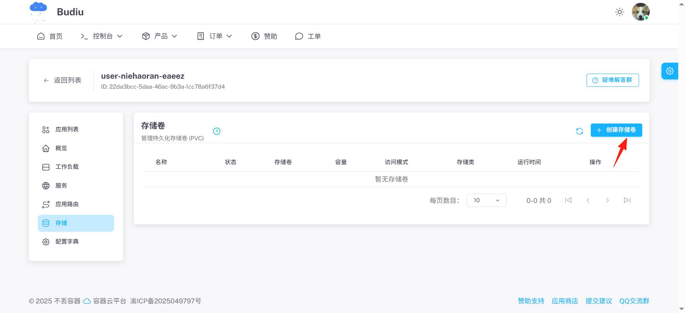
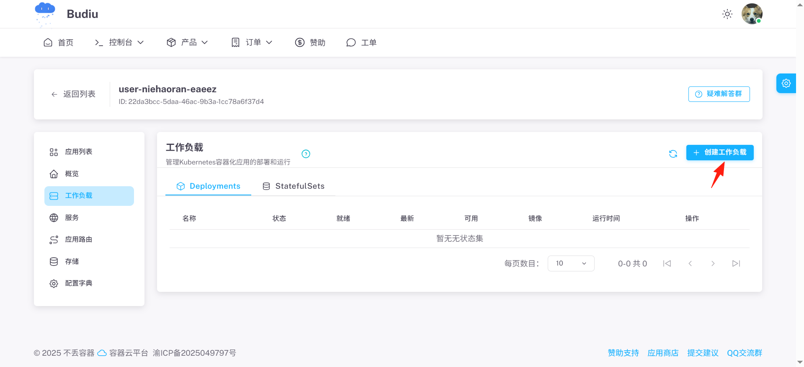
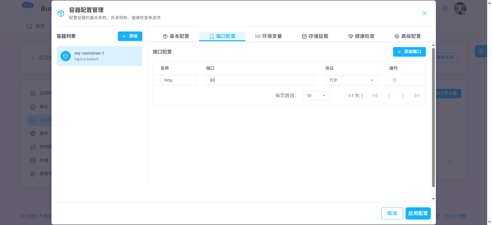
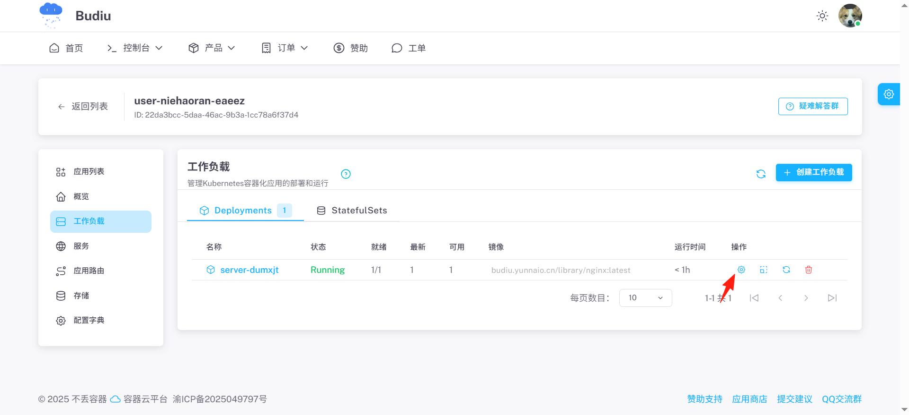
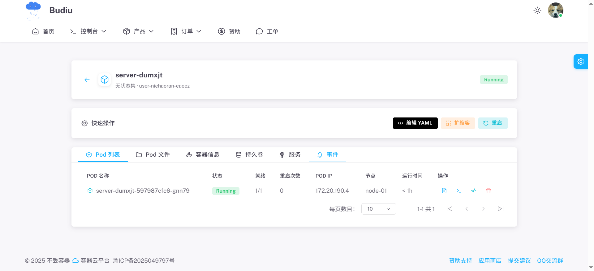
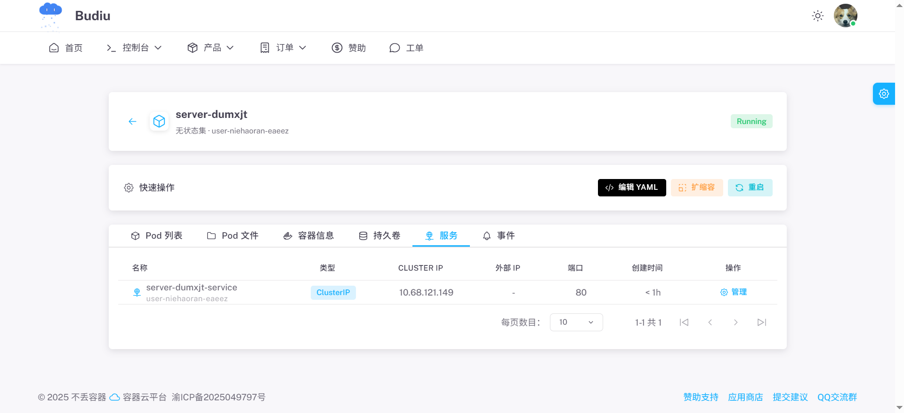
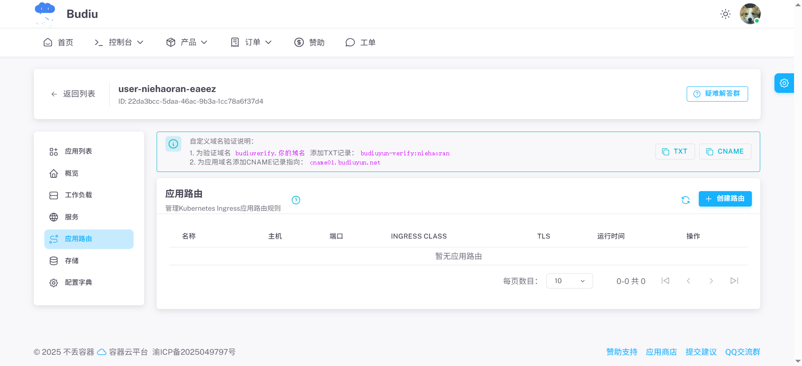
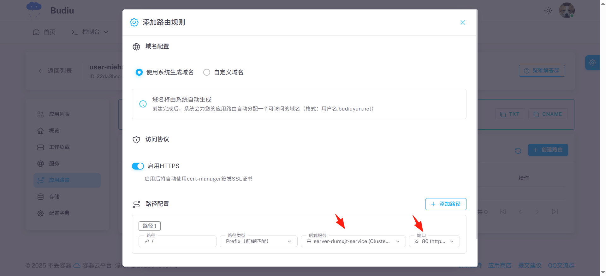
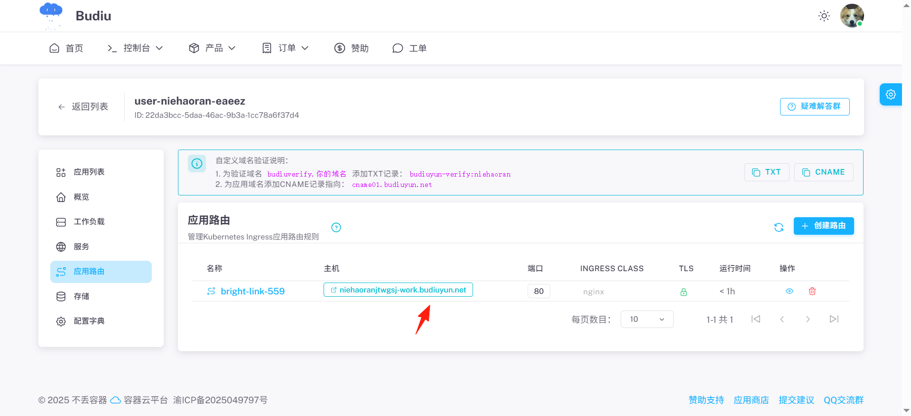

# 部署你的第一个 Nginx 静态网站

欢迎来到不丢云的第一个实战教程！在这个教程中，你将学会如何**1分钟**部署一个可公网访问的静态网站服务器。

## 为什么要用 Nginx 容器？

在不丢云平台中，**应用路由（Ingress）已经为你处理了域名、SSL证书、负载均衡等复杂的网络配置**。你的 Nginx 容器只需要专注于一件事：**高效地提供静态文件服务**。

### 架构原理

```
用户访问 → 应用路由（域名+SSL） → Nginx容器（静态文件服务） → 你的网站
```

**关键优势**：
- **无需配置域名** - 应用路由自动处理
- **自动SSL证书** - 平台统一管理HTTPS和HTTP/2
- **专注业务逻辑** - 只需管理静态文件
- **高性能服务** - Nginx专门优化静态资源

:::tip[你将学到什么]
- 如何创建和管理持久化存储卷
- 如何部署专用的静态文件服务器
- 如何通过应用路由实现外网访问
- 理解平台化部署的优势
:::

---

## 准备工作

在开始部署之前，确保你的容器空间有足够的资源配额。


:::note[资源配额说明]
- **Limits 配额**：限制容器可以使用的资源上限
- **Requests 配额**：容器运行所需的最低资源保证

就像汽车限速一样：Limits 是最高时速 60km/h，Requests 是最低保证速度 20km/h。
:::

---

## 第一步：创建持久化存储卷

<details>
<summary><strong>【可选】创建持久化存储卷</strong></summary>

由于容器重启时会还原，如果你需要持久化保存网站文件，可以创建存储卷。

### 1. 进入存储卷管理页面

在持久卷列表页面，点击 **创建存储卷**



### 2. 配置存储卷参数


```yaml
存储卷名称: nginx-data
存储容量: 1Gi
访问模式: ReadWriteOnce
```

:::important[存储卷配置要点]
- 选择合适的存储容量，根据网站文件大小决定
- `ReadWriteOnce` 模式适合单个容器挂载
:::

### 3. 创建成功确认


</details>

---

## 第二步：部署 Nginx 工作负载

### 1. 创建工作负载

打开工作负载列表，点击 **创建工作负载**



### 2. 选择配置方式


:::tip[配置方式选择]
- **容器配置界面**：适合新手，图形化操作简单
- **YAML 配置**：适合有 Kubernetes 基础的用户
:::

### 3. 基本配置


```yaml
应用名称: nginx-web
镜像地址: nginx:latest
副本数量: 1
资源配置:
  CPU请求: 100m      # 根据实际需求调整
  CPU限制: 500m      # 防止资源过度占用
  内存请求: 128Mi    # 根据网站大小调整
  内存限制: 256Mi    # 设置合理上限
```

:::important[资源配置说明]
- **请求值 (requests)**：容器启动时保证分配的资源
- **限制值 (limits)**：容器可使用的最大资源

**配置建议**：
- 上述数值仅为示例，实际使用需要根据以下因素调整：
  - 网站访问量大小
  - 静态文件数量和大小
  - 服务器硬件资源
  - 其他应用的资源占用

**参考配置**：
- **小型网站**：CPU 50m-100m，内存 64Mi-128Mi
- **中型网站**：CPU 100m-200m，内存 128Mi-256Mi  
- **大型网站**：CPU 200m-500m，内存 256Mi-512Mi

**如何确定合适的配置**：
1. **初始配置**：先用较小的值启动
2. **监控观察**：通过不丢云监控面板查看实际使用情况
3. **逐步调优**：根据监控数据逐步调整
4. **压力测试**：模拟高峰期访问量进行测试
:::

### 4. 端口配置



```yaml
容器端口: 80
协议: TCP
服务类型: ClusterIP
```

:::warning[端口配置注意]
Nginx 默认监听 80 端口，确保端口配置正确，否则服务无法访问。
:::

### 5. 存储卷挂载

<details>
<summary><strong>【可选】配置存储卷挂载</strong></summary>

如果你在第一步创建了存储卷，需要在这里进行挂载配置。


```yaml
选择存储卷: nginx-data
挂载路径: /usr/share/nginx/html
```

:::note[挂载路径说明]
`/usr/share/nginx/html` 是 Nginx 默认的网站文件目录，将存储卷挂载到这里可以持久化保存网站文件。
:::

</details>

### 6. 应用配置并创建


---

<details>
<summary><strong>【可选】查看工作负载管理和监控</strong></summary>

### 查看工作负载状态



在工作负载页面中找到刚创建的应用，点击 **管理** 查看详细信息。

### 查看容器详情



在这里可以查看：
- 容器运行状态
- 资源使用情况  
- 日志信息
- 事件记录

</details>

---

## 第三步：配置外网访问

### 1. 创建服务



进入服务页面，点击 **快速创建服务**

### 2. 创建应用路由



进入应用路由列表，点击 **创建路由**

### 3. 配置路由规则



```yaml
路由名称: nginx-route
域名: 自动生成或自定义  # 平台自动处理域名解析
服务: nginx-web
端口: 80
启用HTTPS: 推荐开启     # 平台自动配置SSL证书
```

:::important[重要理解]
**应用路由的核心作用**：
- **域名管理** - 自动生成或绑定自定义域名
- **SSL证书** - 自动申请和续期HTTPS证书，支持HTTP/2协议
- **负载均衡** - 自动分发流量到多个Pod副本
- **高可用** - 自动健康检查和故障转移

**你的Nginx容器只需要**：
- 监听容器内80端口
- 提供静态文件服务
- **无需配置域名、SSL等网络层面的设置**

**HTTP/2支持说明**：
应用路由在开启HTTPS后会自动启用HTTP/2协议，无需额外配置。HTTP/2相比HTTP/1.1具有以下优势：
- **多路复用** - 单个连接可并行传输多个请求
- **服务器推送** - 主动推送相关资源
- **头部压缩** - 减少请求头大小
- **二进制协议** - 更高效的数据传输

**如何检测HTTP/2**：
1. 浏览器开发者工具 → Network → Protocol列显示"h2"
2. 在线工具检测：访问 https://tools.keycdn.com/http2-test
3. curl命令：`curl -I --http2 https://your-domain.com`
:::

### 4. 获取访问域名



创建成功后会生成可访问的域名，点击即可访问你的网站！

---

## 第四步：验证部署结果

### 访问成功页面


:::tip[上传网站文件]
如果你配置了持久卷，需要手动上传网站文件到存储卷中。如果没有配置持久卷，将看到 Nginx 默认欢迎页面。
:::

---

## 下一步操作

恭喜！你已经成功部署了第一个静态网站服务器。接下来你可以：

1. **上传自定义网站文件** - 将你的 HTML、CSS、JS 文件上传到持久卷
2. **配置自定义域名** - 在应用路由中绑定你自己的域名  
3. **学习高级配置** - 了解Nginx配置优化和缓存策略
4. **部署更复杂应用** - 尝试前后端分离项目部署

### 实际应用场景

**适合用Nginx容器的场景**：
- **个人博客网站** - HTML静态博客
- **前端SPA应用** - React/Vue/Angular应用
- **文档网站** - 技术文档、API文档
- **作品展示站** - 设计作品、摄影作品展示

**Nginx配置示例**（自动生成的简化配置）：
```nginx
# 平台自动优化的nginx.conf
server {
    listen 80;
    # 注意：无需配置server_name，应用路由已处理域名
    
    location / {
        root /usr/share/nginx/html;
        index index.html index.htm;
        try_files $uri $uri/ /index.html;  # SPA应用路由支持
    }
    
    # 静态资源缓存优化（可选）
    location ~* \.(css|js|png|jpg|jpeg|gif|ico|svg)$ {
        expires 30d;
        add_header Cache-Control "public, no-transform";
    }
}
```

:::note[学习建议]
建议继续学习：
- [工作负载管理](/posts/不丢云操作指南-工作负载/) - 深入了解容器管理
- [配置字典](/posts/不丢云操作指南-配置字典/) - 学习高级配置管理
- [MySQL 数据库部署](/posts/不丢云操作指南-部署mysql/) - 数据库服务部署（即将发布）
:::

---

## 常见问题

### Q: 为什么访问网站显示 404？
A: 如果配置了持久卷但没有上传网站文件，会显示 404。请确保在 `/usr/share/nginx/html` 目录中有 `index.html` 文件。

### Q: 如何上传网站文件？
A: 可以通过容器终端或文件管理工具将文件上传到挂载的存储卷中。

### Q: 服务无法访问怎么办？
A: 检查以下几点：
- 容器是否正常运行
- 端口配置是否正确
- 应用路由是否创建成功

---

**总结**：通过这个教程，你学会了不丢云平台的核心优势 - **应用路由自动处理复杂的网络配置，让你专注于业务逻辑**。这种架构设计让容器化部署变得简单高效，无需深入了解传统的域名解析、SSL证书配置等复杂运维知识。

### 关键收获
- **理解平台化优势** - 基础设施自动化管理
- **掌握静态文件服务** - 高性能Web服务器配置  
- **学会存储持久化** - 数据不丢失的容器部署
- **体验一键部署** - 从容器到公网访问的完整流程

这些技能是现代云原生应用部署的基础，可以应用到任何其他服务的部署中！

---

## 相关指南

**基础理论学习：**
- [快速入门篇](/posts/不丢云操作指南-快速入门篇/) - 平台介绍和完整学习路径
- [概览界面](/posts/不丢云操作指南-概览/) - 了解资源配额和监控

**核心功能详解：**
- [工作负载管理](/posts/不丢云操作指南-工作负载/) - 本教程涉及的核心概念详解
- [服务与应用路由](/posts/不丢云操作指南-服务与应用路由/) - 外网访问的完整配置说明

**高级配置：**
- [配置字典](/posts/不丢云操作指南-配置字典/) - 自定义 Nginx 配置文件管理

